<div align="center">
  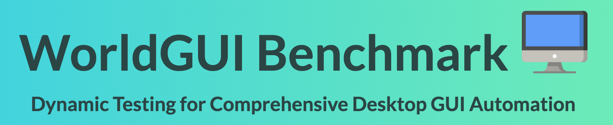
</div>

<details>
<summary style="font-size:18px">✨ What's new in GUI-Thinker?</summary>

<!-- ## ✨ What's new in GUI-Thinker? -->

**GUI-Thinker** is a newly developed GUI agent based on a self-reflection mechanism. We systematically investigate GUI automation and establish the following workflow, incorporating three key self-reflection modules:

- Planner-Critic (Post-Planning Critique): Self-corrects the initial plans to ensure their accuracy

- Step-Check (Pre-Execution Validation): Remove redundant steps or modify them if necessary.

- Actor-Critic (Post-Action Evaluation): Review the task completion status and apply necessary corrections.


<p align="center" style="margin:0">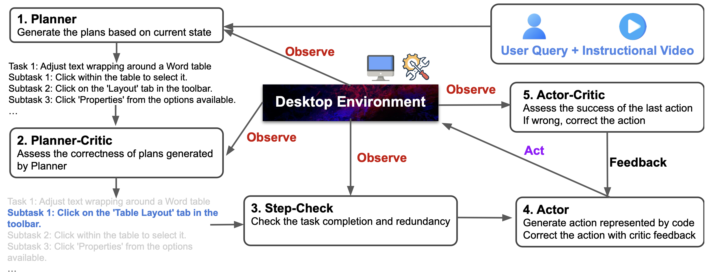</p>

<p align="center">Figure 1: Overview of GUI-Thinker.</p>

<p align="center" style="margin:0">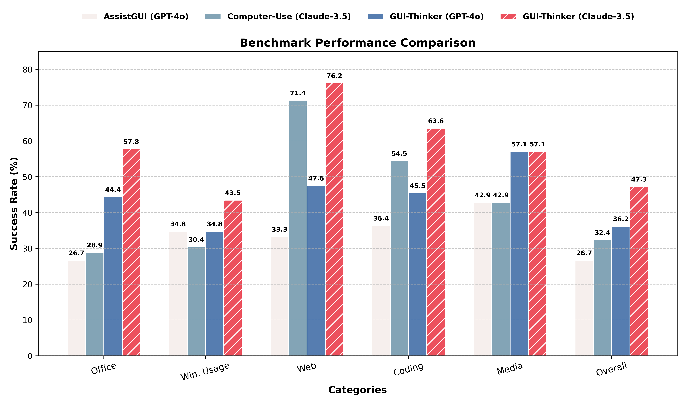</p>

<p align="center">Figure 2: Comparison of various agents on the WorldGUI Benchmark (meta task).</p>

</details>

## 🚀 Getting Started


## 1. Clone the Repository 📂
Open the Conda Terminal. (After installation Of Miniconda, it will appear in the Start menu.)
Run the following command on **Conda Terminal**.
```bash
git clone https://github.com/showlab/GUI-Thinker.git
cd GUI-Thinker
```

## 2. Env setup 🔨

To create a Conda virtual environment and activate it, follow these steps:

Create a new Conda environment named `guithinker` with Python 3.11 installed:

```bash
conda create -n guithinker python=3.11
conda activate guithinker
pip install -r requirements.txt
```

Install the dependencies:
```bash
pip install -r requirements.txt
```
Moreover, you can refer to the files under folder `.log` to manually install the corresponding modules.

## 3. Set API Key ✏️
We recommend running one or more of the following command to set API keys to the environment variables. On Windows Powershell (via the set command if on cmd):

>```bash
>$env:ANTHROPIC_API_KEY="sk-xxxxx" (Replace with your own key)
>$env:GEMINI_API_KEY="sk-xxxxx"
>$env:OPENAI_API_KEY="sk-xxxxx"
>```

## 4. Set Google Clound Vision API 🔧
We implement our GUI parser with the help of [google clound vision service](https://cloud.google.com/vision?hl=zh_cn). We recommend you following this [guidance](https://cloud.google.com/vision/product-search/docs/auth?hl=zh-cn) to save a local file for the identity verification.

```bash
gcloud auth activate-service-account --key-file KEY_FILE

$env:GOOGLE_APPLICATION_CREDENTIALS="PATH_TO_KEY_FILE"
```

(Optional) Set the path of `KEY_FILE` in the path [agent/gui_parser/server.py#L18](https://github.com/showlab/WorldGUI/blob/main/agent/gui_parser/server.py#L18)

## 5. Quick Start ⭐

Start with your own query or included query in folder `data`.

### 5.1 Start the server

We implemented a backend and frontend system that separates screenshot capture from agent execution, enabling remote deployment of the agent via API calls. The frontend can run on Windows or other platforms (e.g., mobile devices).

For windows:
```bash
.\shells\start_server.bat
```
You can track the status by checking the files under folder `.log`. Every time you change the files under the folder **`agent`**, you need to restart the server.

### Restart the server

For windows:
```bash
.\shells\end_server.bat
.\shells\start_server.bat
```
### 🎈 5.2 Test with your own user query

Here, we provide a straightforward example demonstrating how to operate a YouTube video using the Claude-3.5-Sonnet as the base model. Check the configuration of file `agent\config\basic.yaml` to edit the base model.

Command:
```bash
python test_guithinker_custom.py --userquery "Open the video "https://www.youtube.com/watch?v=uTuuz__8gUM", add to watch later and create a watch list 'work & jazz'." --projfile_path "" --software_name "Youtube"
```

<!-- Demo Video (The video has been sped up):

https://github.com/user-attachments/assets/5d25c079-4c84-4435-8280-591f32f89700

See 1080p version from https://www.youtube.com/watch?v=RoJ-cbjfZmg -->

Initial Screenshot:
<p align="left"></p>

(Milestone 1) Task 1: Add video to Watch Later 

Subtask 1: Click on "More actions" button [1231, 936]
<p align="left"></p>
Subtask 2: Click on "Save" option in the menu that appears
<p align="left"></p>
Subtask 3: Click on "Watch Later" option in the save menu
<p align="left">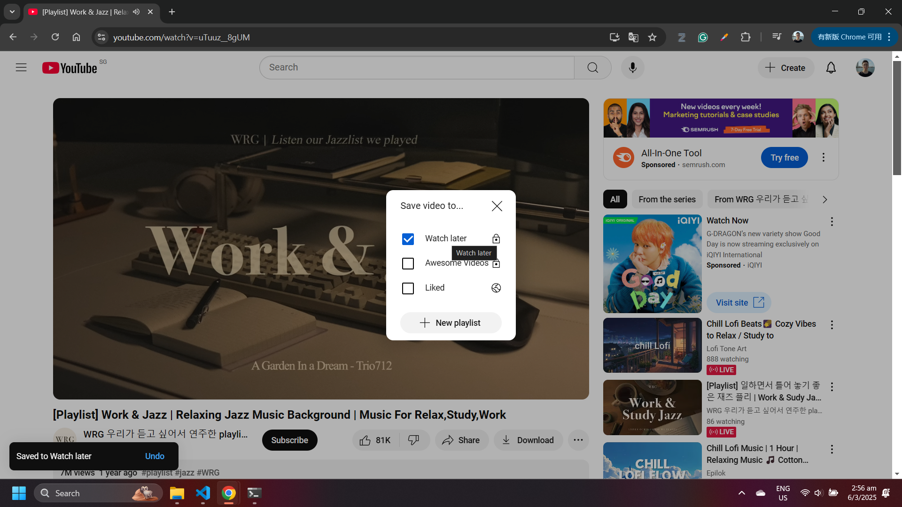</p>

(Milestone 2) Task 2: Create new playlist "work & jazz" 

Subtask 1: Click on "More actions" button again if the menu closed

Output of Step-Check: `<Pass>`. Therefore no change in current step. (See the deatail design of Step-Check from [paper](https://arxiv.org/abs/2502.08047))

<p align="left">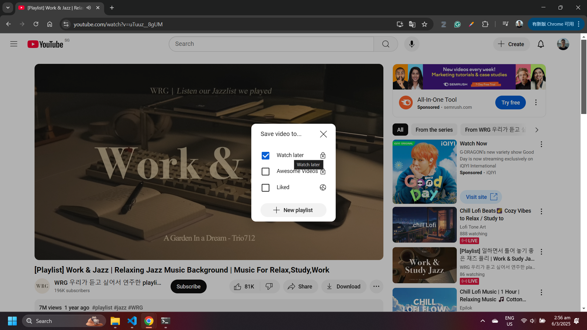</p>

Subtask 2: Click on "Save" option if the save menu is not open

Output of Step-Check: `<Pass>`. Therefore no change in current step.
<p align="left"></p>

Subtask 3: Click on "+ Create new playlist" option at the bottom of the save menu
<p align="left">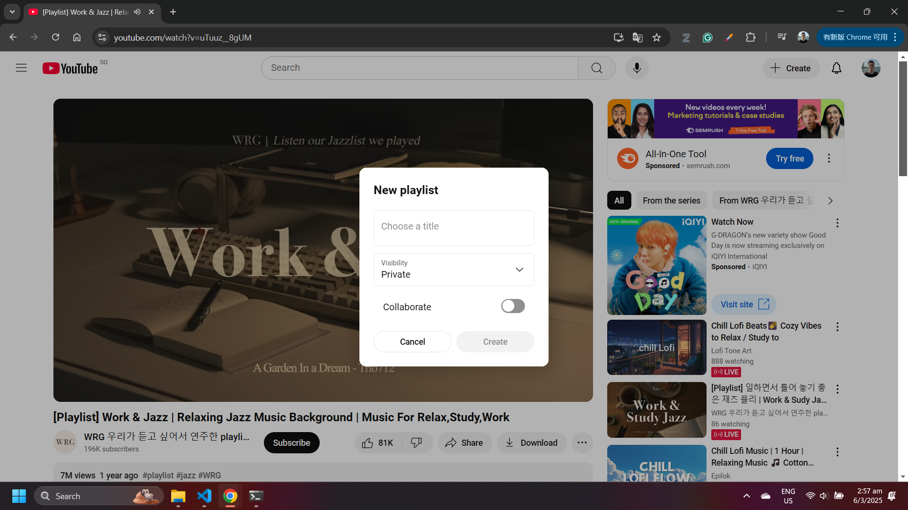</p>

Subtask 4: Type "work & jazz" in the playlist name field
<p align="left">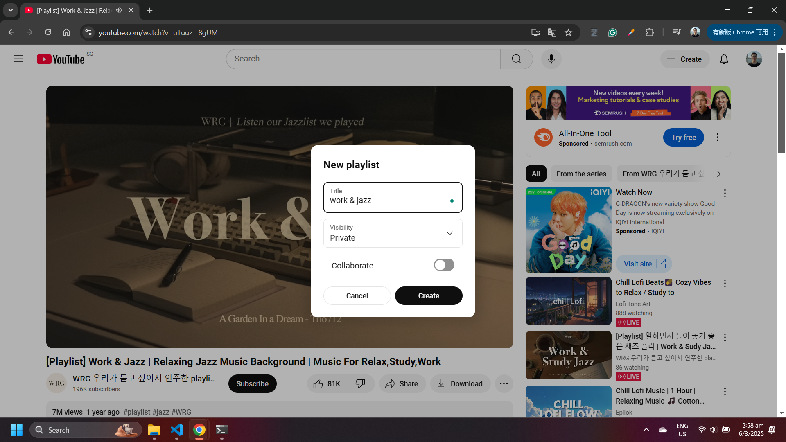</p>

Subtask 5: Click "Create" button to confirm the new playlist creation
<p align="left"></p>


### 💻 5.3 Test with a simple demo case under the folder `data`:
```bash
python test_guithinker_demo.py
``` 

User Query: Select all text and apply numbered list for them. Use '1, 2, 3' symbol of numbered list.

Initial Screenshot:
<p align="left">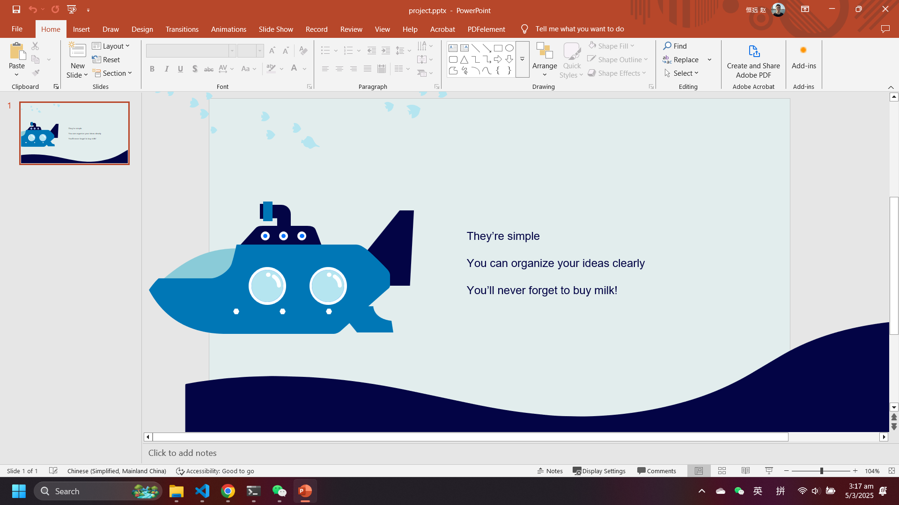</p>

Intermediate Screenshot:
<p align="left">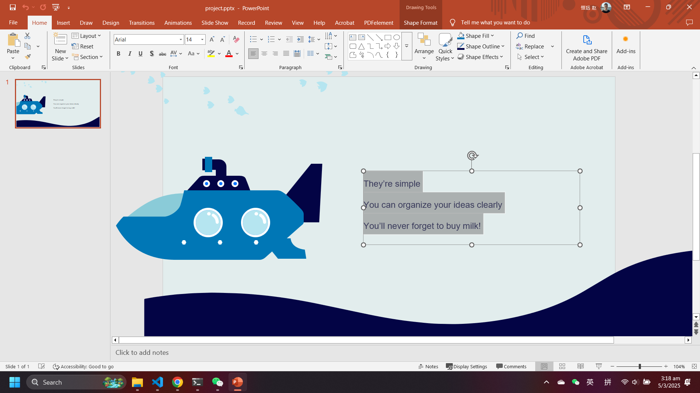</p>

Invoke the *Region Search* component in the Step-Check Module, which yields the following image:
<p align="left">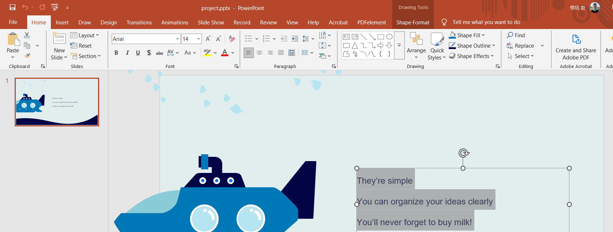</p>

Reducing the resolution and directing the agent's focus toward highly relevant regions will enhance its critique decisions.

Final Screenshot:
<p align="left">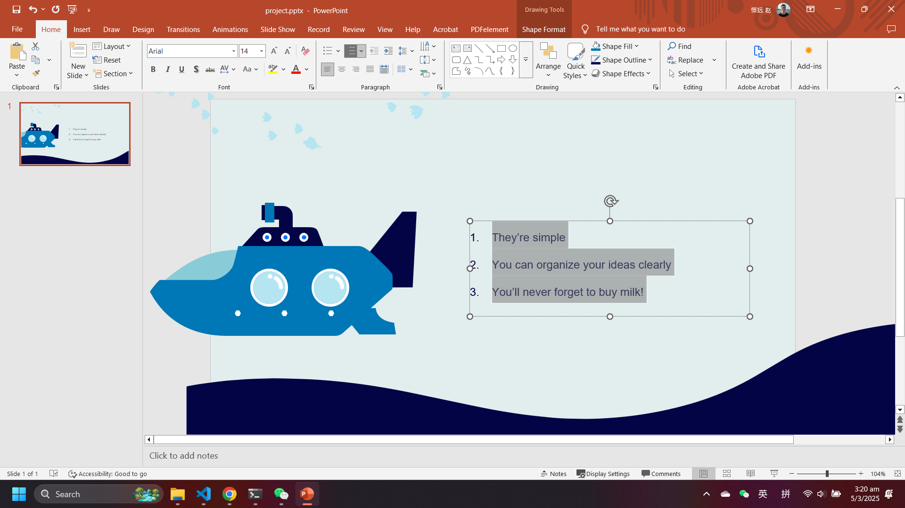</p>